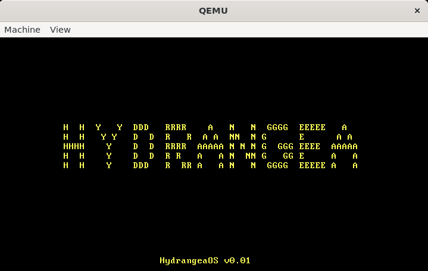

# HydrangeaOS

`绣球操作系统`

stage1.asm (扇区1)
    ↓ 收集基本硬件信息
    ↓ 加载stage2 (扇区2-5)
stage2.asm (扇区2-5)  
    ↓ 收集更多硬件信息
    ↓ 保存到0x5000 区域
    ↓ 进入保护模式
    ↓ 跳转到system模块
system (内核)
    ↓ 读取0x5000 的硬件信息
    ↓ 根据实际硬件初始化驱动

## 当前阶段

`阶段4`

<!-- - 基本显示驱动 -->
- 建立基本IDT
- 设置关键中断门
- 加载IDT
- 汇编入口桩（Stub）
- C语言中断分发器
- 初始化PIC
- 定时器中断配置

## 目标

### 阶段1

- 从0x7C00处读取了512字节的MBR文件，输出启动日志(✅)

### 阶段2

设置GDT(✅)
开启A20地址线(✅)
关中断并设置CRO，进入保护模式(✅)

### 阶段3

- 进入保护模式(✅)
- 告别16位实模式，进入32位世界(✅)

### 阶段4

- 进入C内核(✅)
- 基本显示驱动(✅)
- 异常处理基础(❌)
- 中断控制器初始化(❌)
- 键盘驱动(❌)
- 定时器驱动(❌)

### 阶段5

- 进程调度：多个程序同时运行(❌)

### 阶段6

- 内存管理：malloc/free(❌)

### 阶段7

- 文件系统(❌)

### 阶段8

- 系统调用接口(❌)
- 简单的任务管理(❌)

### 文件组织方式

- include/: 放头文件，便于其他文件使用
- drivers/: 放和硬件有关的c文件
- lib/: 放一些基础函数文件

### 遇到的问题

#### 阶段二

- 进入保护模式前，未设置实模式下关中断。
- 除此之外gdt_start设置的基址必须为一个可覆盖的区域，而且gdt_descriptor的指向gdt_start的地址不用加0x7E00直接写gdt_start的地址。
- 在关中断（cli）后千万不敢再调用bios的中断，否则就会刷屏触发qemu的三重中断

#### 阶段四

- 设置kernel_main的入口地址错误，导致调试无法进入C内核
- 栈顶的位置需要合理的选择，防止和内核代码0x9000碰撞，因为栈会向低地址增长，而内核代码会向高地址增长
- 解决O0、O1、O2优化问题，默认用O1 -g，千万要注意，在O2情况下有些函数被优化没了，还有一些不同的变量也优化没了
- 注意有些代码写了inline但不会强制内联，这样就会导致向后挤压kernel_main的最终的位置 -> 触发三重中断。
- 注意没有优化过的显存操作真的很慢！有时不是你程序的问题，而是硬件速度的问题。
- 注意普通函数头文件不要写static + inline 要分成头 + 源文件，对于内联函数要强制内联 + static 否则触发三重中断。对于只有在头文件千万不要写未修饰的函数实现，不然其他文件引用这个文件进行链接时有重复定义，比如main.o提供memset，string.o也提供memset这样肯定有问题，如果头文件是声明，源文件是实现，就只会有一个。
