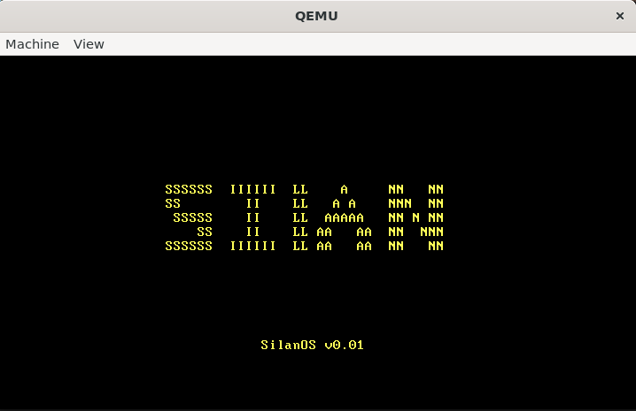

# TuixOS

`Tuix操作系统`

<!-- stage1.asm (扇区1)
    ↓ 收集基本硬件信息
    ↓ 加载stage2 (扇区2-5)
stage2.asm (扇区2-5)  
    ↓ 收集更多硬件信息
    ↓ 保存到0x5000 区域
    ↓ 进入保护模式
    ↓ 跳转到system模块
system (内核)
    ↓ 读取0x5000 的硬件信息
    ↓ 根据实际硬件初始化驱动 -->
## boot

交由GRUB引导加载器来做

1. sudo apt-get install grub2-common grub-pc-bin

2. sudo apt-get install xorriso

3. 统计行数

```makefile
find . -name "*.c" -o -name "*.h" | xargs wc -l
```

1. 如果修改时git忘记pull了，可以使用rebase这个选项来重建

```makefile
git pull --rebase
...
git push
```

## 内存信息

- stage1入口0x7c00(旧)
- 内核加载在0x9000(旧)
- 栈顶在0x7000(旧)
内核加载在0x80000000 高地址虚拟地址，实际放在0x100000 1MB物理地址处
当前qemu模拟256MB内存


## 当前阶段

`架构文件系统，首先实现一个内存文件系统`

## 目标

### 阶段1

- 从0x7C00处读取了512字节的MBR文件，输出启动日志(✅)

### 阶段2

设置GDT(✅)
开启A20地址线(✅)
关中断并设置CRO，进入保护模式(✅)

### 阶段3

- 进入保护模式(✅)
- 告别16位实模式，进入32位世界(✅)

### 阶段4

- 进入C内核(✅)
- 基本显示驱动(✅)
- 异常处理基础(✅)
- 中断控制器初始化(✅)
- 键盘驱动(✅)
- 定时器驱动(✅)

### 阶段5

- 内存管理：kalloc/kfree(✅)

### 阶段6

- 虚拟内存管理(恒等映射已完成)
启动分页 → 内核恒等映射 → 处理缺页异常 → 分配物理页 → 返回用户继续执行

1. 设计虚拟内存布局

2. 建立内核高端映射
- 将物理内存映射到内核虚拟空间的高端

3. 实现虚拟内存分配器
- 管理进程的虚拟地址空间
- 维护每个进程的页表


### 阶段7

- 进程调度：多个程序同时运行(❌))

### 阶段8

- 文件系统(❌)

### 阶段9

- 系统调用接口(❌)
- 简单的任务管理(❌)

### 遇到的问题

#### 实模式

- 进入保护模式前，未设置实模式下关中断。
- 除此之外gdt_start设置的基址必须为一个可覆盖的区域，而且gdt_descriptor的指向gdt_start的地址不用加0x7E00直接写gdt_start的地址。
- 在关中断（cli）后千万不敢再调用bios的中断，否则就会刷屏触发qemu的三重中断

#### 保护模式

- [已解决] 设置kernel_main的入口地址错误，导致调试无法进入C内核
- [已解决] gdt的段基址要为0，平坦模式
- [已解决] 栈顶的位置需要合理的选择，防止和内核代码0x9000碰撞，因为栈会向低地址增长，而内核代码会向高地址增长
- [已解决] 解决O0、O1、O2优化问题，默认用O1 -g，千万要注意，在O2情况下有些函数被优化没了，还有一些不同的变量也优化没了
- [已解决] 注意有些代码写了inline但不会强制内联，这样就会导致向后挤压kernel_main的最终的位置 -> 触发三重中断。
- [已解决] 注意没有优化过的显存操作真的很慢！有时不是你程序的问题，而是硬件速度的问题。
- [已解决] 注意普通函数头文件不要写static + inline 要分成头 + 源文件，对于内联函数要强制内联 + static 否则触发三重中断。对于只有在头文件千万不要写未修饰的函数实现，不然其他文件引用这个文件进行链接时有重复定义，比如main.o提供memset，string.o也提供memset这样肯定有问题，如果头文件是声明，源文件是实现，就只会有一个。
- [已解决] (1 << bit_index) 可以创建掩码来与位做运算
- [已解决] 记住static是局部作用域，写在源文件里，千万别写在.h文件中，否则每个包含该头文件的.c文件都会得到自己的副本，可能导致重复定义或链接错误
- [已解决] 警告：千万记住了头文件不写static，否则会出现一堆奇怪的bug
- [已解决] 警告：注意压栈是会把内容压在高地址，esp指针向低地址的位置增长，所以对于fun(var1,var2,var3)来说压入顺序是var3->var2->var1，同理如果是压入结构体指针，结构体的顺序1，2，3，4，那么压栈就要4->3->2->1
- [已解决] 警告：注意当内核文件增大后，制作的磁盘也要相应增大，否则造成数据截断，执行不了代码，打印不了字符串

#### 中断系统
- [已解决] 中断系统中,必须要先初始化pic再开中断,否则就会触发双重中断
- [待解决/引入grub已解决] 无法分多次读取多个扇区来读入内核,注意在使用CHS读取扇区,由于实模式的限制只能读取64KB,所以后续交由保护模式来读取
- [已解决] 注意grub是将整个目录打包成一个iso镜像文件，所以它是在内存里加载内核文件的，而不是在硬盘上加载内核文件。
- [已解决] 引入grub后由于忘记设置gdt表，所以导致中断响应触发qemu重启，设置好后可正常运行
- [已解决] 出现了页共享!!!(解决方案：`对于共享页应该按"已用"处理,硬件保留区域优先级高于可用RAM`)使用位图法标记实际的物理内存还是有问题，会有重叠区域0x9F000 - 0x9FFFF: 这是第0x9F页的范围，而0x9FC00 - 0x9FFFF: 这是区域1的实际范围。

#### 虚拟内存
- [已解决] 恒等映射，记得要设置硬件，如果页表项为0，则会导致qemu重启。

#### 进程管理
- [已解决] 任务返回内核，一定要记住push了几次那么就要对应的pop几次，否则会导致栈帧不平衡，那么eip就会得到错误的地址，这就导致了出现一些莫名奇妙的bug。除此之外，对call和ret的理解还是不到位，导致了其他错误，call是先压入参数最后压入返回地址，而ret先pop读出返回地址在+4恢复栈指针
- [已解决] 需要立即生效的操作 → 用 "=m"；可以接受延迟存储的操作 → 用 "=r"，注意不要混用了，否则触发寄存器异常无效的操作码
- [已解决] `"pushfl\n" "cli\n"`其中pushfl是保存eflags的，如果pushfl在关中断后执行那么就会导致此时的IF值为0，这样后续的进程就无法响应中断事件了。
- [已解决] 注意执行中断处理程序时不能调用schedule，应该只设置标志位，在中断返回前或系统调用前检查标志执行调度
- [待解决] 在实现抢占式切换时，时钟中断触发后，此时中断处理调用使用的是A的栈，而不是内核的中断栈，这就会导致栈溢出，输出乱码，所以中断时应该前往内核栈，在内核中断中执行调度策略。除此之外，还发现任务中打印操作执行的太多会导致栈溢出，这可能是我把用户栈污染了的缘故吧？
- [已解决] 共享资源竞争，两个任务都在使用串口打印，但打印不是原子性的，就非常容易奔溃，所以在串口打印中需要保持原子性。
- [已解决] 对于抢占式切换时，之前使用的中断调度，虽然让任务确实能被打断并交替执行，但需要对打印函数上锁，而且这还是在用户栈上进行中断处理不安全，有可能导致栈溢出，所以我后面加了tss段，打算区分内核态与用户态，但在初始化进程上下文时，发现如果给进程设置用户态的标志，会导致GPF(通用寄存器错误)果然还是哪里有问题，需要去找找对于tss的相关资料，才有可能解决。
1. 实际上这个问题其实是由于我在任务初始化时就进行了时间片的调度，而且在schedule函数中没有检查是否已经初始化就绪队列，这样导致后面的页故障等问题，只需要加入检查并初始化即可解决
2. 上面是失败的一个原因，最主要的是在定时器中断中虽然修改了frame的esp，但实际上用的依旧是A第一个任务的任务栈，也就是说后续所有的任务切换都在A栈上，而每次A B在执行任务时总是会使用同一个栈，这导致了一个很严重的问题，那么A的数据可能会污染B，这是由于这个公共栈上也放的是中断栈，也就是说这个公共栈既放了A的数据，也放了B的数据，更关键的是还放了中断栈的数据，那么这必然导致了数据覆盖，任务数据将中断数据覆盖了这是极其严重的问题，例如中断返回时弹出eip如果这个地方eip被A污染，那么势必导致eip跑丢，所以解决这个问题的核心就是每个任务必须要用独立的栈，不能共用同一个栈，除了内核栈可以被共用。

- [待解决] 内核态到用户态以及多任务切换，内核态到用户态首先初始化tss，设置tr寄存器指向tss的位置
再对所有任务初始化内核栈，内核栈上放有完整的中断帧数据，以便上下文切换。
但目前遇到了一个十分奇怪的问题，我在使用iret进入用户态时，虽然进入了task_A函数但是立马奔溃了，显示为权限错误，p=0，w/r=0后面标志位都为0，但实际虚拟地址对应的不总为0，并且每次都是一致地为0，这十分地奇怪。还有这不是分页的错，也不是TLB软硬件不一致的导致的。
这个错误我现在大概知道是哪个方向的错误了，我为了简化内核态转到用户态代码，而在内核text段中命名了一个函数作为起始进程执行，这是行不通的，因为此时已经将权限降低到用户态了，所以你访问存在内核态的这个代码，必然触发页故障，所以，我们应该要将用户代码段以及数据段映射到用户的页表中，让处于用户态的进程能够正确访问。


#### 文件系统

#### 其他

- [已解决] 参考xv6源码进入kernel_main()前先开启4MB大页,设置双重映射,修改链接器脚本将内核加载到高地址0x80100000位置处,实际存放在0x00100000处,为了后续进程管理分页做好准备。值得一提的是在entry结束处,最后要使用jmp跳转至kernel_main,不要使用call否则调试时,pc无法正确跳转到虚拟高地址,原因在于call使用相对跳转,jmp是直接跳转,还有值的注意的一点是call默认会push返回值地址,而jmp不会,所以必须最后手动push一次.

- [已解决] 在实现init_kvm后，发现继续执行其他函数时eip会跑丢，分析后发现是页面映射标志位的问题，当把内核的text+rodata改为可写后，正常执行，但这并不合理，最后发现其实是是栈段位置的问题，由于我之前设置的栈段放在了text段，因此，我无论是跳转函数还是分配变量都会出错，原因是这些操作都是在写入栈上的数据，触发了写权限错误，因此我需要把栈段放在bss段，不应该放在text段，这是由于我的疏忽导致错误的。

- [已解决] 如果遇到页表错误多想想是不是页面映射没有映射，页目录项、页表项的权限位是否合理，比如没有加可写位、用户位等权限导致触发了页错误。
