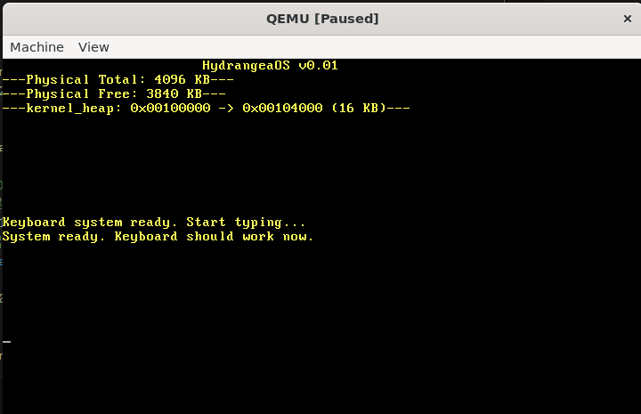

# ~HydrangeaOS~（改为SilanOS以我的名字命名）

## 开发理念 

```makedown
1. 我开发的OS使用图形模式，但不实现图形GUI，而是实现TUI，
    也就是说我的系统主要是基于TUI来实现的，我追求的不是华丽的演出效果，
    而是追求的是极致的工作效率。

2. 我不选择文本模式渲染，有人问这样不是更加高效吗，
    但我想说的是这虽然有着极致的性能但显示字符非常少，字符也不美观，
    在长时间工作小，必然造成眼睛疲劳，因此我选择使图形模式。

3. 而且我还要为我的TUIOS实现一个更加现代化的界面，你知道的传统TUI界面往往都比较简陋，而且智能度不够。

4. 最后还要实现在tui里面看视频和看图片，甚至能够实现浏览网页。
```

## IMAGE
`绣球操作系统`



## 2025年12月底的工作主线在此更新

1. 修复完引入grub后中断系统的奔溃
2. 修改内嵌汇编语法-masm=intel
3. 修改qemu为串口输出模式
4. 优化gdb，让其更容易调试
5. 先实现虚拟内存
6. 再实现进程管理
7. 最后完成文件系统

stage1.asm (扇区1)
    ↓ 收集基本硬件信息
    ↓ 加载stage2 (扇区2-5)
stage2.asm (扇区2-5)  
    ↓ 收集更多硬件信息
    ↓ 保存到0x5000 区域
    ↓ 进入保护模式
    ↓ 跳转到system模块
system (内核)
    ↓ 读取0x5000 的硬件信息
    ↓ 根据实际硬件初始化驱动

## 内存位置
（以实际为主）
- stage1入口0x7c00
- 内核加载在0x9000
- 栈顶在0x7000

## 当前阶段
`阶段暂定`
- 无

## 目标

### 阶段1

- 从0x7C00处读取了512字节的MBR文件，输出启动日志(✅)

### 阶段2

设置GDT(✅)
开启A20地址线(✅)
关中断并设置CRO，进入保护模式(✅)

### 阶段3

- 进入保护模式(✅)
- 告别16位实模式，进入32位世界(✅)

### 阶段4

- 进入C内核(✅)
- 基本显示驱动(✅)
- 异常处理基础(❌)
- 中断控制器初始化(❌)
- 键盘驱动(❌)
- 定时器驱动(❌)

### 阶段5

- 进程调度：多个程序同时运行(❌)

### 阶段6

- 内存管理：malloc/free(❌)

### 阶段7

- 文件系统(❌)

### 阶段8

- 系统调用接口(❌)
- 简单的任务管理(❌)

### 文件组织方式

- include/: 放头文件，便于其他文件使用
- drivers/: 放和硬件有关的c文件
- lib/: 放一些基础函数文件

### 遇到的问题

#### 阶段二

- 进入保护模式前，未设置实模式下关中断。
- 除此之外gdt_start设置的基址必须为一个可覆盖的区域，而且gdt_descriptor的指向gdt_start的地址不用加0x7E00直接写gdt_start的地址。
- 在关中断（cli）后千万不敢再调用bios的中断，否则就会刷屏触发qemu的三重中断

#### 阶段四

- (已解决)设置kernel_main的入口地址错误，导致调试无法进入C内核
- (已解决)gdt的段基址要为0
- (已解决)栈顶的位置需要合理的选择，防止和内核代码0x9000碰撞，因为栈会向低地址增长，而内核代码会向高地址增长
- (已解决)解决O0、O1、O2优化问题，默认用O1 -g，千万要注意，在O2情况下有些函数被优化没了，还有一些不同的变量也优化没了
- (已解决)注意有些代码写了inline但不会强制内联，这样就会导致向后挤压kernel_main的最终的位置 -> 触发三重中断。
- (已解决)注意没有优化过的显存操作真的很慢！有时不是你程序的问题，而是硬件速度的问题。
- (已解决)注意普通函数头文件不要写static + inline 要分成头 + 源文件，对于内联函数要强制内联 + static 否则触发三重中断。对于只有在头文件千万不要写未修饰的函数实现，不然其他文件引用这个文件进行链接时有重复定义，比如main.o提供memset，string.o也提供memset这样肯定有问题，如果头文件是声明，源文件是实现，就只会有一个。
- (已解决)(1 << bit_index) 可以创建掩码来与位做运算
- (已解决)记住static是局部作用域，写在源文件里，千万别写在.h文件中，否则每个包含该头文件的.c文件都会得到自己的副本，可能导致重复定义或链接错误
- (已解决)警告：千万记住了头文件不写static，否则一堆奇怪的问题，还有千万千万不要用O0！！！，它不会优化栈帧，这就导致了我定义的字符常量太多的话就无法打印(悲!)（耗费了4小时找错误）
- (已解决)警告：注意压栈是会把内容压在高地址，esp指针向低地址的位置增长，所以对于fun(var1,var2,var3)来说压入顺序是var3->var2->var1，同理如果是压入结构体指针，结构体的顺序1，2，3，4，那么压栈就要4->3->2->1
- (已解决)警告：注意当内核文件增大后，制作的磁盘也要相应增大，否则造成数据截断，执行不了代码，打印不了字符串
- (已解决)中断系统中,必须要先初始化pic再开中断,否则就会触发双重中断
- (待解决)无法分多次读取多个扇区来读入内核
- (待解决)注意在使用CHS读取扇区,由于实模式的限制只能读取64KB,所以后续交由保护模式来读取
